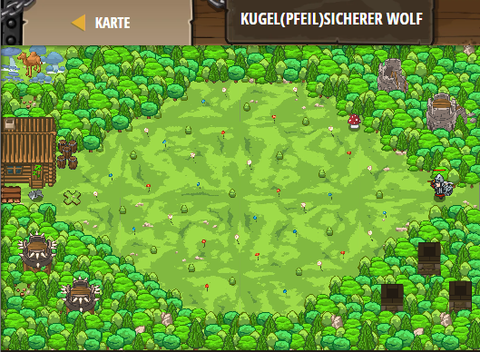

## **Kugel(Pfeil)Sicherer Wolf**
## Level 4.b37

#### Neu Gelerntes:
<b>-</b>

[comment]: <> (Was wurde gelernt und wie funktioniert die Technik?)

#### JavaScript-Code:
```js
hero.moveXY(12, 35);
hero.say("o");
// Als nächstes sammel Pilze (items).
while(true) {
    var item = hero.findNearestItem();
    if (item) {
        hero.moveXY(item.pos.x, item.pos.y);
    }
}
```
