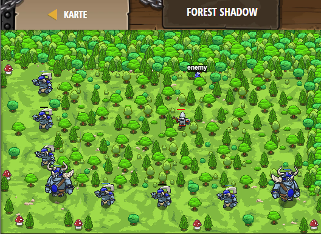

## **Forest Shadow**
## Level 4.b38

#### Neu Gelerntes:
<b>-</b>

[comment]: <> (Was wurde gelernt und wie funktioniert die Technik?)

#### JavaScript-Code:
```js
while (true) {
    var enemy = hero.findNearestEnemy();
    if (enemy) {
        if (enemy.type == "thrower" || enemy.type == "munchkin") {
            hero.attack(enemy);
        }
    }
    var item = hero.findNearestItem();
    if (item) {
        if (item.type == "gem" || item.type == "coin") {
            hero.moveXY(item.pos.x, item.pos.y);
        }
    }
}
```
