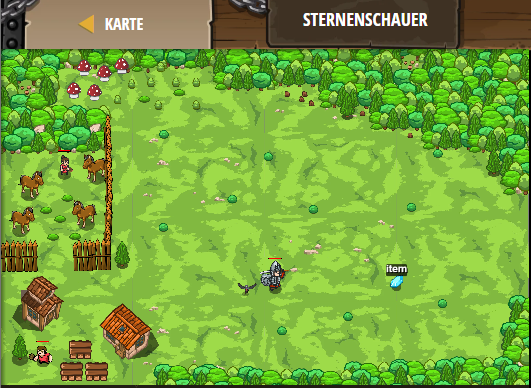

## **Sternenschauer**
## Level 4.b39

#### Neu Gelerntes:
<b>-</b>

[comment]: <> (Was wurde gelernt und wie funktioniert die Technik?)

#### JavaScript-Code:
```js
while (true) {
    var item = hero.findNearestItem();
    var distance = hero.distanceTo(item);
    if (item.type == "gem" || distance < 20) {
        hero.moveXY(item.pos.x, item.pos.y);
    }
}
```
