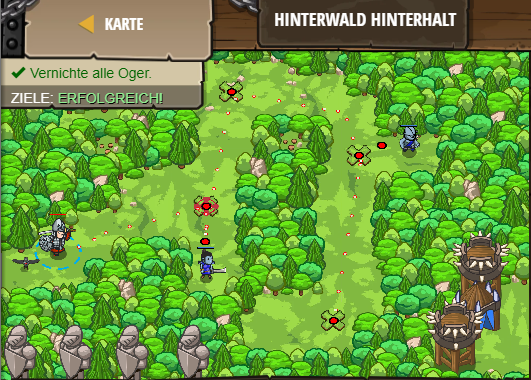

## **Hinterwald Hinterhalt**
## Level 4.b4

#### Neu Gelerntes:
<b>-</b>

[comment]: <> (Was wurde gelernt und wie funktioniert die Technik?)

#### JavaScript-Code:
```js
hero.moveXY(24, 42);
var enemy = hero.findNearestEnemy();
if(enemy) {
    hero.attack(enemy);
    hero.attack(enemy);
}

hero.moveXY(27, 60);
enemy = hero.findNearestEnemy();
if(enemy) {
    // Attack the enemy if it exists!
    hero.attack(enemy);
}

hero.moveXY(42, 50);
enemy = hero.findNearestEnemy();
// Use an if-statement to check if an enemy exists.
if (enemy) {
    hero.attack(enemy);
}
    // Attack the enemy if it exists!

hero.moveXY(39, 24);
// Find the nearest enemy:
var enemy = hero.findNearestEnemy();

// Check if the enemy exists:
if (enemy) {
    hero.attack(enemy);
}
```
