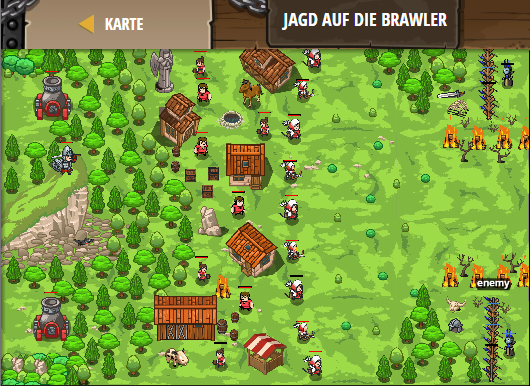

## **Jagd auf die Brawler**
## Level 4.b40

#### Neu Gelerntes:
<b>-</b>

[comment]: <> (Was wurde gelernt und wie funktioniert die Technik?)

#### JavaScript-Code:
```js
while (true) {
    var enemy = hero.findNearestEnemy();
    if (enemy) {
        var distance = hero.distanceTo(enemy);
        if (enemy.type == "brawler" && distance < 50) {
            hero.say("Fire!");
        }
    }
}
```
