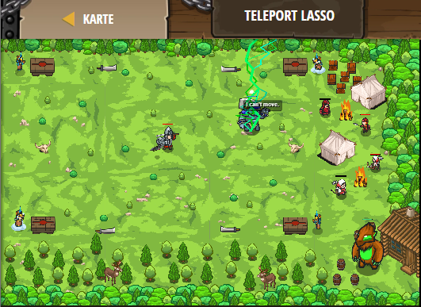

## **Teleport Lasso**
## Level 4.b41

#### Neu Gelerntes:
<b>-</b>

[comment]: <> (Was wurde gelernt und wie funktioniert die Technik?)

#### JavaScript-Code:
```js
while (true) {
    var enemy = hero.findNearestEnemy();
    var distance = hero.distanceTo(enemy);
    if (enemy.type == "munchkin" && distance < 20) {
        hero.attack(enemy);
    }
}
```
