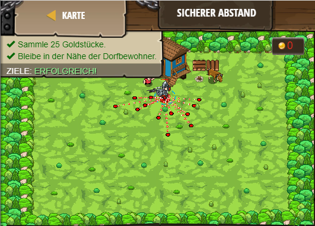

## **Sicherer Abstand**
## Level 4.b42

#### Neu Gelerntes:
<b>-</b>

[comment]: <> (Was wurde gelernt und wie funktioniert die Technik?)

#### JavaScript-Code:
```js
while (true){
    var item = hero.findNearestItem();
    if (item){
        var p = hero.distanceTo(item);
        if (p < 15) {
                  hero.moveXY(item.pos.x,item.pos.y);
        hero.moveXY(42, 45);
        }
    }
}
```
