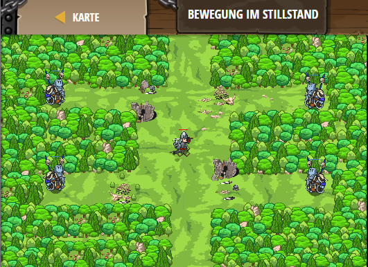

## **Bewegung im Stillstand**
## Level 4.b44

#### Neu Gelerntes:
<b>-</b>

[comment]: <> (Was wurde gelernt und wie funktioniert die Technik?)

#### JavaScript-Code:
```js
while(true) {
    var enemy = hero.findNearestEnemy();
    if(enemy) {
        var distance = hero.distanceTo(enemy);
        if (distance < 5) {
           hero.attack(enemy);            
        }
        else {
            hero.shield();
        }
    } else {
        hero.moveXY(40, 34);
    }
}
```
