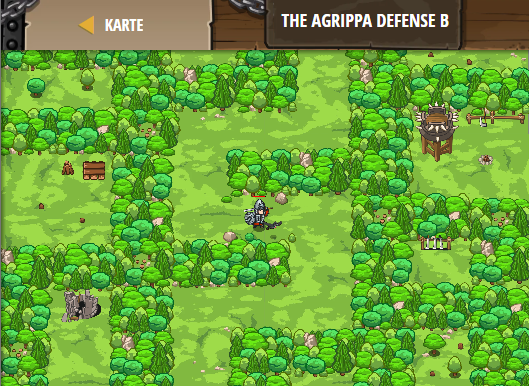

## **The Agrippa Defense B**
## Level 4.b47

#### Neu Gelerntes:
<b>-</b>

[comment]: <> (Was wurde gelernt und wie funktioniert die Technik?)

#### JavaScript-Code:
```js
while(true) {
    var enemy = hero.findNearestEnemy();
    if(enemy) {
        var distance = hero.distanceTo(enemy);
        if (distance < 5) {
            if (hero.isReady("cleave")) {
                hero.cleave(enemy);
            }
            else {
                hero.attack(enemy);
            }
        }
    }
}
```
