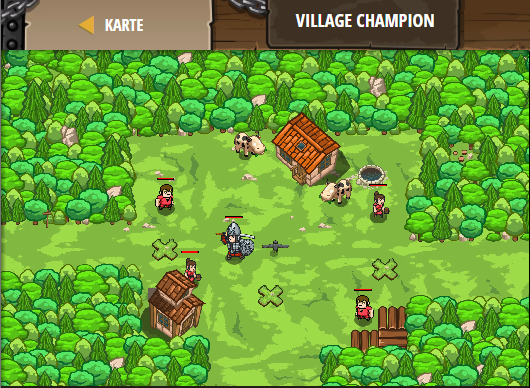

## **Village Champion**
## Level 4.b48

#### Neu Gelerntes:
<b>-</b>

[comment]: <> (Was wurde gelernt und wie funktioniert die Technik?)

#### JavaScript-Code:
```js
function cleaveOrAttack() {
    var ogre = hero.findNearestEnemy();
    if (ogre) {
        if (hero.isReady("cleave")) {
            hero.cleave(ogre);
        }
        else {
            hero.attack(ogre);
        }
    }
}
while (true) {
    hero.moveXY(35, 34);
    cleaveOrAttack();
    hero.moveXY(47, 27);
    cleaveOrAttack();
    hero.moveXY(60, 31);
    cleaveOrAttack();
}
```
