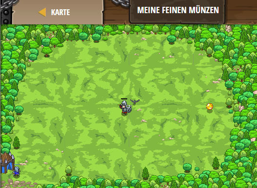

## **Meine feinen Münzen**
## Level 4.b50

#### Neu Gelerntes:
<b>-</b>

[comment]: <> (Was wurde gelernt und wie funktioniert die Technik?)

#### JavaScript-Code:
```js
function pickUpCoin() {
    var coin = hero.findNearestItem();
    if(coin) {
        hero.moveXY(coin.pos.x, coin.pos.y);
    }
}
function attackenemy() {
    var enemy = hero.findNearestEnemy();
    if (enemy) {
        hero.attack(enemy);        
    }
}
while(true) {
    attackenemy();
    pickUpCoin();
}
```
