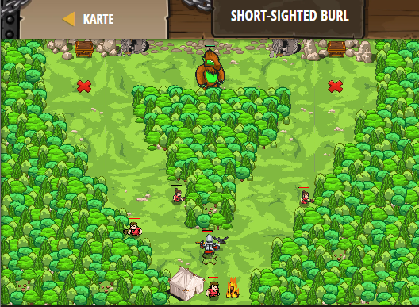

## **Short-sighted Burl**
## Level 4.b51

#### Neu Gelerntes:
<b>-</b>

[comment]: <> (Was wurde gelernt und wie funktioniert die Technik?)

#### JavaScript-Code:
```js
function takeItem(item) {
    hero.moveXY(item.pos.x, item.pos.y);
}
function checkTakeRun(item) {
    if (item) {
        takeItem(item);
    }
    hero.moveXY(40, 12);
}
while (true) {
    hero.moveXY(16, 56);
    var coin = hero.findNearestItem();
    checkTakeRun(coin);
    hero.moveXY(64, 56);
    coin = hero.findNearestItem();
    checkTakeRun(coin);
}
```
