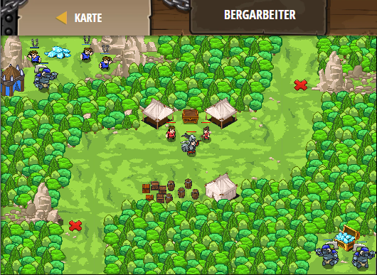

## **Bergarbeiter**
## Level 4.b52

#### Neu Gelerntes:
<b>-</b>

[comment]: <> (Was wurde gelernt und wie funktioniert die Technik?)

#### JavaScript-Code:
```js
function checkEnemyOrSafe(target) {
    if (target) {
        hero.attack(target);
    }
    else {
        hero.say("a");
    }
}
while (true) {
    hero.moveXY(64, 54);
    var enemy1 = hero.findNearestEnemy();
    checkEnemyOrSafe(enemy1);
    hero.moveXY(16, 14);
    var enemy2 = hero.findNearestEnemy();
    checkEnemyOrSafe(enemy2)
}
```
