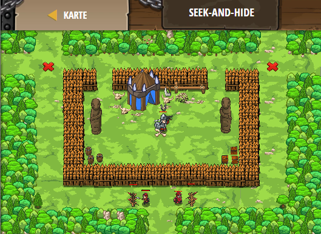

## **Seek-and-hide**
## Level 4.b53

#### Neu Gelerntes:
<b>-</b>

[comment]: <> (Was wurde gelernt und wie funktioniert die Technik?)

#### JavaScript-Code:
```js
function checkTakeHide(item) {
    if (item) {
        hero.moveXY(item.pos.x, item.pos.y);
        hero.moveXY(40, 34);
    }
}
while (true) {
    hero.moveXY(68, 56);
    var lightstone = hero.findNearestItem();
    checkTakeHide(lightstone);
    hero.moveXY(12, 56);
    var lightstone = hero.findNearestItem();
    checkTakeHide(lightstone);
}
```
