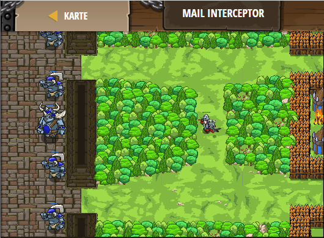

## **Mail Interceptor**
## Level 4.b54

#### Neu Gelerntes:
<b>-</b>

[comment]: <> (Was wurde gelernt und wie funktioniert die Technik?)

#### JavaScript-Code:
```js
function ambushAttack(target) {
    if (target) {
        hero.attack(target);
    }
    else {
        hero.moveXY(51, 35);
    }
}
while(true) {
    var ogre = hero.findNearestEnemy();
    ambushAttack(ogre);
}
```
