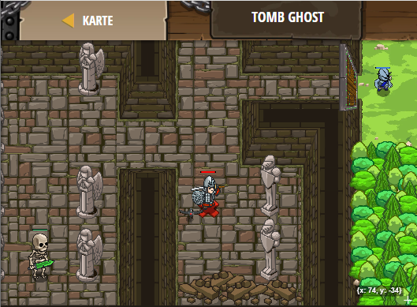

## **Tomb Ghost**
## Level 4.b55

#### Neu Gelerntes:
<b>-</b>

[comment]: <> (Was wurde gelernt und wie funktioniert die Technik?)

#### JavaScript-Code:
```js
function hitOrHide(target) {
    if (target) {
         hero.attack(target);   
    }
        hero.moveXY(32, 17);
}
while (true) {
    var enemy = hero.findNearestEnemy();
    hitOrHide(enemy);
}
```
