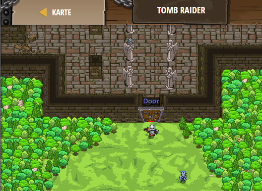

## **Tomb Raider**
## Level 4.b56

#### Neu Gelerntes:
<b>-</b>

[comment]: <> (Was wurde gelernt und wie funktioniert die Technik?)

#### JavaScript-Code:
```js
function checkToDefend(target) {
    if (target) {
        hero.attack(target);        
    }
    else {
        hero.attack("Door");
    }
}
while(true) {
    var enemy = hero.findNearestEnemy();
    checkToDefend(enemy);
}
```
