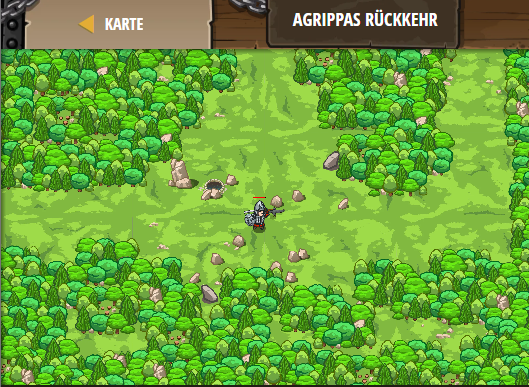

## **Agrippas Rückkehr**
## Level 4.b57

#### Neu Gelerntes:
<b>-</b>

[comment]: <> (Was wurde gelernt und wie funktioniert die Technik?)

#### JavaScript-Code:
```js
function enemyInRange(enemy) {
    var distance = hero.distanceTo(enemy);
    if (distance < 5) {
        return true;
    }
    else {
        return false;
    }
}
function cleaveOrAttack(enemy) {
    if (hero.isReady("cleave")) {
        hero.cleave(enemy);
    } 
    else {
        hero.attack(enemy);
    }
}
while(true) {
    var enemy = hero.findNearestEnemy();
    if(enemy) {
        if (enemyInRange(enemy)) {
            cleaveOrAttack(enemy);
        }
    }
}
```
