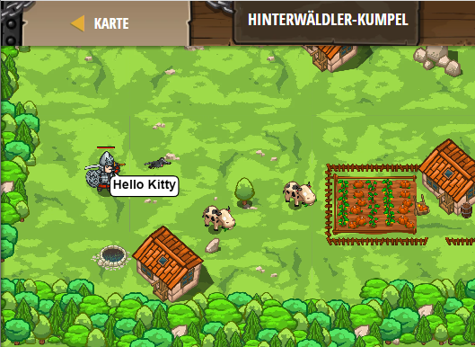

## **Hinterwäldler-Kumpel**
## Level 4.b59

#### Neu Gelerntes:
<b>-</b>

[comment]: <> (Was wurde gelernt und wie funktioniert die Technik?)

#### JavaScript-Code:
```js
function speak(event) {
    pet.say("a");
}
pet.on("hear", speak);
hero.say("Hello Kitty");
```
