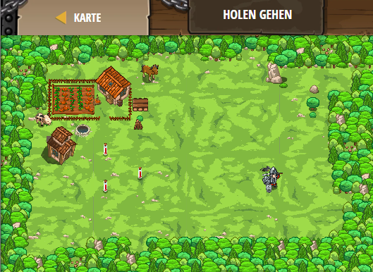

## **Holen gehen**
## Level 4.b60

#### Neu Gelerntes:
<b>-</b>

[comment]: <> (Was wurde gelernt und wie funktioniert die Technik?)

#### JavaScript-Code:
```js
function goFetch() {
    while(true) {
        var potion = hero.findNearestItem();
        if(potion) {
            pet.fetch(potion);
        }
    }
}
pet.on("spawn", goFetch);
```
