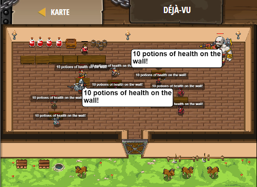

## **Déjà-vu**
## Level 4.b61

#### Neu Gelerntes:
<b>-</b>

[comment]: <> (Was wurde gelernt und wie funktioniert die Technik?)

#### JavaScript-Code:
```js
var potionsOnTheWall = 10;
var numToTakeDown = 1;
while(true) {
    hero.say(potionsOnTheWall + " potions of health on the wall!");
    hero.say(potionsOnTheWall + " potions of health");
    hero.say("Take " + numToTakeDown + " down, pass it around!");
    potionsOnTheWall -= numToTakeDown;
    hero.say(potionsOnTheWall + " potions of health on the wall!");
}
```
