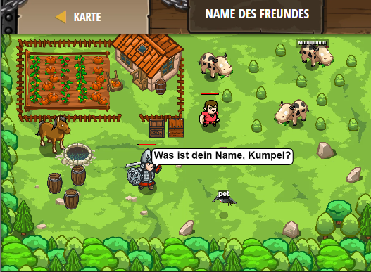

## **Name des Freundes**
## Level 4.b62

#### Neu Gelerntes:
<b>-</b>

[comment]: <> (Was wurde gelernt und wie funktioniert die Technik?)

#### JavaScript-Code:
```js
function onHear(event) {
    pet.say("Miau Schnurr Miau");
    pet.say("Schnurr Schnurr");
    pet.say("Miau");
    pet.say("Miau");
    pet.say("Miau Schnurr Miau Miau");
}
pet.on("hear", onHear);
hero.say("Was ist dein Name, Kumpel?");
hero.say("Kannst du das wiederholen?");
```
