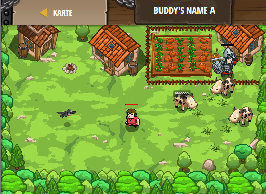

## **Buddy's Name A**
## Level 4.b63

#### Neu Gelerntes:
<b>-</b>

[comment]: <> (Was wurde gelernt und wie funktioniert die Technik?)

#### JavaScript-Code:
```js
function sayName(event) {
    pet.say("My name is Furious Beast.");
    pet.say("But my friends call me Fluffy.");
}
pet.on("hear", sayName);
```
