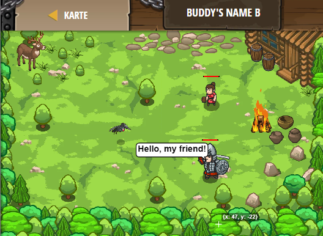

## **Buddy's Name B**
## Level 4.b64

#### Neu Gelerntes:
<b>-</b>

[comment]: <> (Was wurde gelernt und wie funktioniert die Technik?)

#### JavaScript-Code:
```js
function sayHello(event) {
    pet.say("Salutations.");
}
pet.on("hear", sayHello);
hero.say("Hello, my friend!");
```
