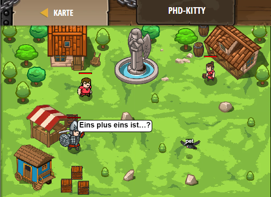

## **PHD-kitty**
## Level 4.b65

#### Neu Gelerntes:
<b>-</b>

[comment]: <> (Was wurde gelernt und wie funktioniert die Technik?)

#### JavaScript-Code:
```js
function sayTwo(event) {
    pet.say("2");
}
pet.on("hear", sayTwo);
hero.say("Eins plus eins ist…?");
hero.say("x^3 - 6x^2 + 12x - 8 = 0. Was ist x...?");
hero.say("Wie viele Monde hat der Mars…?");
```
