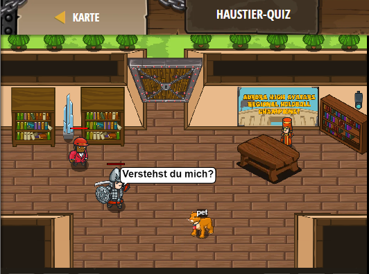

## **Haustier-Quiz**
## Level 4.b66

#### Neu Gelerntes:
<b>-</b>

[comment]: <> (Was wurde gelernt und wie funktioniert die Technik?)

#### JavaScript-Code:
```js
function onHear(event) {
    pet.say("ja");
}
pet.on("hear", onHear);
hero.say("Verstehst du mich?");
hero.say("Bist du ein Puma?");
hero.say("Wie alt bist du?");
hero.say("Meintest du 20?");
hero.say("Magst du Kekse");
```
