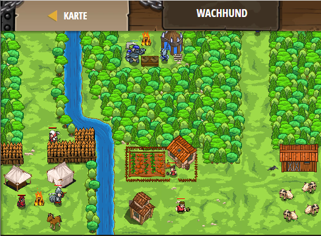

## **Wachhund**
## Level 4.b67

#### Neu Gelerntes:
<b>-</b>

[comment]: <> (Was wurde gelernt und wie funktioniert die Technik?)

#### JavaScript-Code:
```js
function onSpawn(event) {
    while (true) {
        var enemy = pet.findNearestEnemy();
        if (enemy) {
                  pet.say("Hamburger Royal TS");
        }
    }
}
pet.on("spawn", onSpawn);
```
