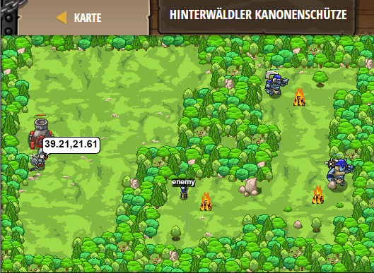

## **Hinterwälder Kanonenschutze**
## Level 4.b68

#### Neu Gelerntes:
<b>-</b>

[comment]: <> (Was wurde gelernt und wie funktioniert die Technik?)

#### JavaScript-Code:
```js
while(true) {
    var enemy = hero.findNearestEnemy();
    if(enemy) {
        var x = enemy.pos.x;
        var y = enemy.pos.y; 
        hero.say(x + ',' + y);
    } else {
        hero.say("Cease" + " " + "Fire!");
    }
}
```
