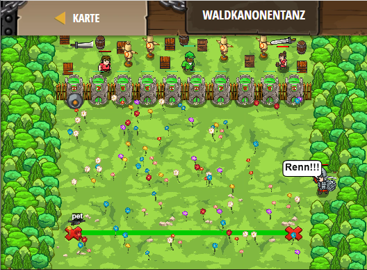

## **Waldkanonentanz**
## Level 4.b69

#### Neu Gelerntes:
<b>-</b>

[comment]: <> (Was wurde gelernt und wie funktioniert die Technik?)

#### JavaScript-Code:
```js
function onSpawn() {
    while(true) {
    pet.moveXY(48, 8);
    pet.moveXY(12, 8);
}
}
pet.on("spawn", onSpawn);
while (true) {
    hero.say("Renn!!!");
    hero.say("Schneller!");
}
```
