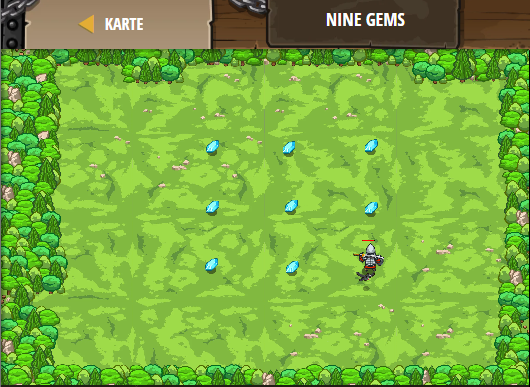

## **Nine Gems**
## Level 4.b7

#### Neu Gelerntes:
<b>-</b>

[comment]: <> (Was wurde gelernt und wie funktioniert die Technik?)

#### JavaScript-Code:
```js
// Collect all the gems in 4 moveXY's or less!
// Programmers need to think creatively!
hero.moveXY(33, 60);
hero.moveXY(31, 8);
hero.moveXY(56, 35);
hero.moveXY(56, 50);
```
