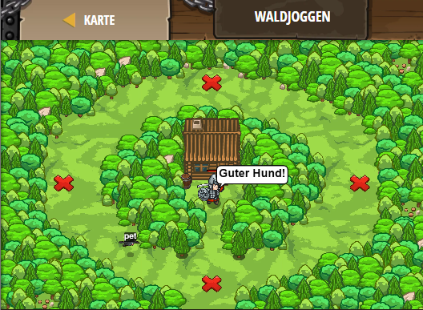

## **Waldjoggen**
## Level 4.b70

#### Neu Gelerntes:
<b>-</b>

[comment]: <> (Was wurde gelernt und wie funktioniert die Technik?)

#### JavaScript-Code:
```js
function onSpawn(event) {
    while(true) {
        pet.moveXY(9, 24);
        pet.moveXY(30, 43);
        pet.moveXY(51, 24);
        pet.moveXY(30, 5);
    }
}
pet.on("spawn", onSpawn);
while(true) {
    hero.say("Guter Hund!");
    hero.say("Du kannst es machen!");
    hero.say("Renn, Renn, Renn!");
    hero.say("Fast!");
    hero.say("Noch eine Runde!");
}
```
