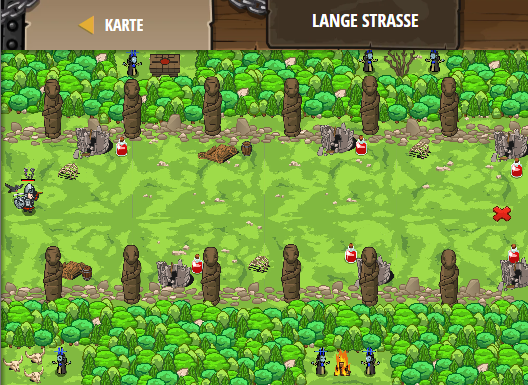

## **Lange Strasse**
## Level 4.b71

#### Neu Gelerntes:
<b>-</b>

[comment]: <> (Was wurde gelernt und wie funktioniert die Technik?)

#### JavaScript-Code:
```js
function onSpawn(event){
    while(true) {
        var item = pet.findNearestByType("potion");
        if (item) {
            pet.fetch(item);
        }
    }
}
pet.on("spawn", onSpawn);
hero.moveXY(78, 35);
```
