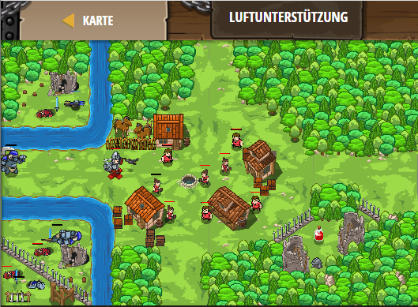

## **Luftunterstützung**
## Level 4.b72

#### Neu Gelerntes:
<b>-</b>

[comment]: <> (Was wurde gelernt und wie funktioniert die Technik?)

#### JavaScript-Code:
```js
function onSpawn (event) {
    while(true) {
        var item = hero.findNearestItem();
        if (item) {
            pet.fetch(item);
        } 
    }
}
pet.on("spawn", onSpawn);
while(true) {
    var enemy = hero.findNearestEnemy();
    if (enemy) {
    var distance = hero.distanceTo(enemy);
    if (distance < 10) {
        hero.attack(enemy);
    }
    } 
    else {
        hero.moveXY(22, 34);
    }    
}
```
