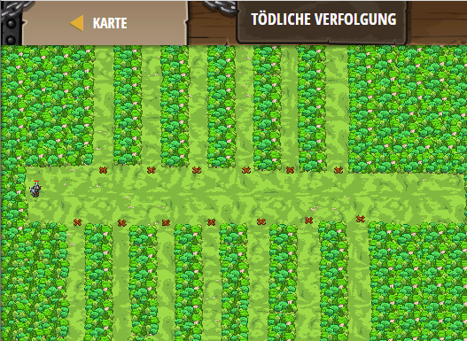

## **Tödliche Verfolgung**
## Level 4.b73

#### Neu Gelerntes:
<b>-</b>

[comment]: <> (Was wurde gelernt und wie funktioniert die Technik?)

#### JavaScript-Code:
```js
while(true) {
    var flag = hero.findFlag();
    var item = hero.findNearestItem();
    if (flag) {
        hero.pickUpFlag(flag);
        hero.buildXY("fire-trap", flag.pos.x, flag.pos.y);
    }
    else if (item) {
        hero.moveXY(item.pos.x, item.pos.y);
    }
}
```
