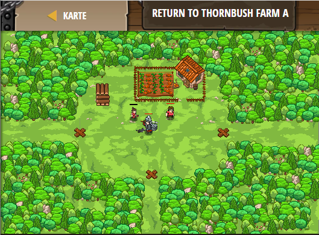

## **Return to Thornbush Farm A**
## Level 4.b75

#### Neu Gelerntes:
<b>-</b>

[comment]: <> (Was wurde gelernt und wie funktioniert die Technik?)

#### JavaScript-Code:
```js
function maybeBuildTrap(x, y) {
    hero.moveXY(x, y);
    var enemy = hero.findNearestEnemy();
    if(enemy) {
        hero.buildXY("fire-trap", x, y);
    }
}
while(true) {
    maybeBuildTrap(20, 34);
    maybeBuildTrap(38, 20);
    maybeBuildTrap(56, 34);
}
```
