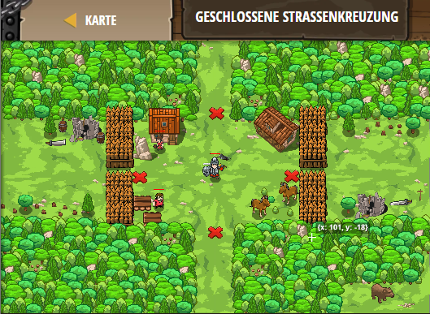

## **Geschlossene Strassenkreuzung**
## Level 4.b76

#### Neu Gelerntes:
<b>-</b>

[comment]: <> (Was wurde gelernt und wie funktioniert die Technik?)

#### JavaScript-Code:
```js
function maybeBuildSomething(typeToBuild, x, y) {
    hero.moveXY(x, y);
    var enemy = hero.findNearestEnemy();
    if (enemy) {
        hero.buildXY(typeToBuild, x, y);
    }
}
while(true) {
    maybeBuildSomething("fire-trap", 40, 20);
    maybeBuildSomething("fence", 26, 34);
    maybeBuildSomething("fire-trap", 40, 50);
    maybeBuildSomething("fence", 54, 34);
}
```
