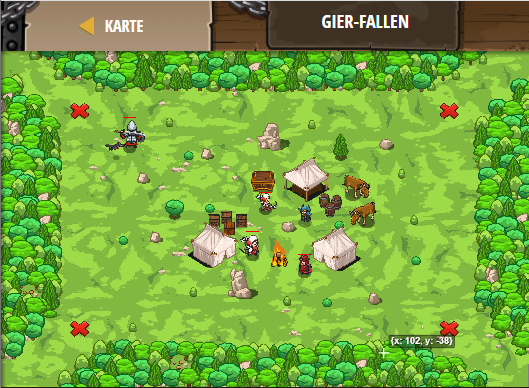

## **Gier-Fallen**
## Level 4.b77

#### Neu Gelerntes:
<b>-</b>

[comment]: <> (Was wurde gelernt und wie funktioniert die Technik?)

#### JavaScript-Code:
```js
function maybeBuildTrap(x, y) {
    hero.moveXY(x, y);
    var item = hero.findNearestItem();
    if (item) {
        hero.buildXY("fire-trap", x, y);
    }
}
while (true) {
    maybeBuildTrap(12, 56);
    maybeBuildTrap(68, 56);
    maybeBuildTrap(68, 12);
    maybeBuildTrap(12, 12);
}
```
