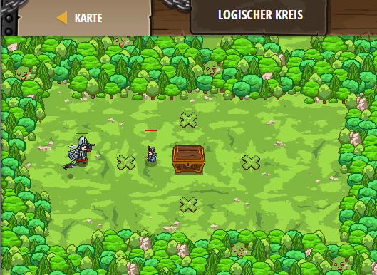

## **Logischer Kreis**
## Level 4.b78

#### Neu Gelerntes:
<b>-</b>

[comment]: <> (Was wurde gelernt und wie funktioniert die Technik?)

#### JavaScript-Code:
```js
hero.moveXY(20, 24);
var secretA = hero.findNearestFriend().getSecretA();
var secretB = hero.findNearestFriend().getSecretB();
var secretC = hero.findNearestFriend().getSecretC();
var secretD = secretA && secretB && secretC;
if (secretD){
    hero.moveXY(30, 33);
}
else{
    hero.moveXY(30, 15);
}
var secretE = secretA || secretB || secretC;
if (secretE) {
    hero.moveXY(20, 24);
}
else {
    hero.moveXY(40, 24);
}
if (secretA && secretB && secretC && secretD && secretE) {
    hero.moveXY(30, 33);
}
else {
    hero.moveXY(30, 15);
}
```
