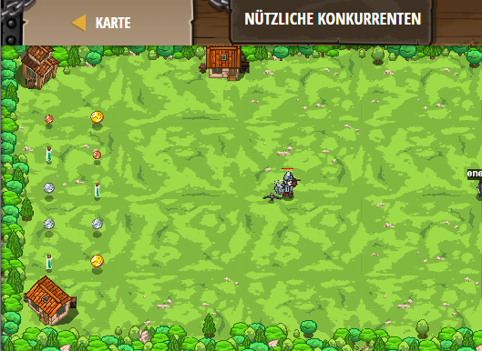

## **Nützliche Konkurrenten**
## Level 4.b79

#### Neu Gelerntes:
<b>-</b>

[comment]: <> (Was wurde gelernt und wie funktioniert die Technik?)

#### JavaScript-Code:
```js
while(true) {
    var enemy = hero.findNearestEnemy();
    if(enemy) {
        if(enemy.type != "peon") {
            hero.attack(enemy);
        }
    }
    var item = hero.findNearestItem();
    if(item) {
        if (item.type !== "poison") {
            hero.moveXY(item.pos.x, item.pos.y);
        }
    }
}
```
