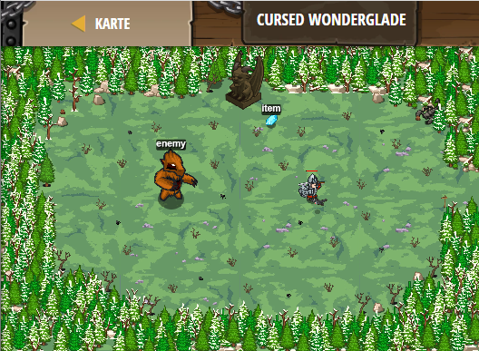

## **Cursed Wonderglade**
## Level 4.b81

#### Neu Gelerntes:
<b>-</b>

[comment]: <> (Was wurde gelernt und wie funktioniert die Technik?)

#### JavaScript-Code:
```js
while (true) {
    var item = hero.findNearestItem();
    if (item && item.type !== "gem") {
        hero.moveXY(item.pos.x, item.pos.y);
    }
    var enemy = hero.findNearestEnemy();
    if (enemy && enemy.type !== "burl") {
        hero.attack(enemy);
    }
}
```
