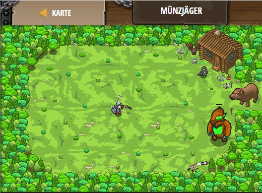

## **Münzjäger**
## Level 4.b82

#### Neu Gelerntes:
<b>-</b>

[comment]: <> (Was wurde gelernt und wie funktioniert die Technik?)

#### JavaScript-Code:
```js
function isCoinClose(coin) {
    var distance = hero.distanceTo(coin);
    if (distance < 20) {
        return true;
    }
    else {
        return false;
    }
}
while (true) {
    var item = hero.findNearestItem();
    if (item) {
        if (isCoinClose(item)) {
            hero.moveXY(item.pos.x, item.pos.y);
        }
    }
}
```
