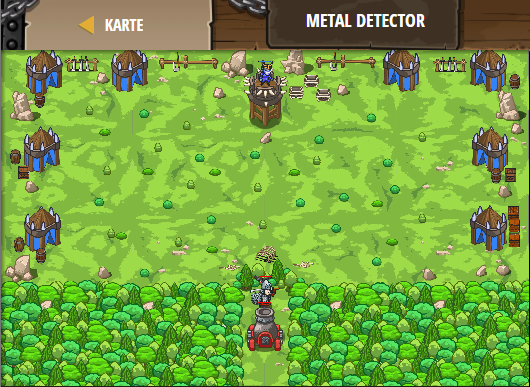

## **Metal Detector**
## Level 4.b83

#### Neu Gelerntes:
<b>-</b>

[comment]: <> (Was wurde gelernt und wie funktioniert die Technik?)

#### JavaScript-Code:
```js
function coinDistance() {
    var item = hero.findNearestItem();
    if (item) {
        return hero.distanceTo(item);
    }
    else {
        return 0;
    }
}
while (true) {
    var distance = coinDistance();
    if (distance > 0) {
        hero.say(distance);
    }
}
```
