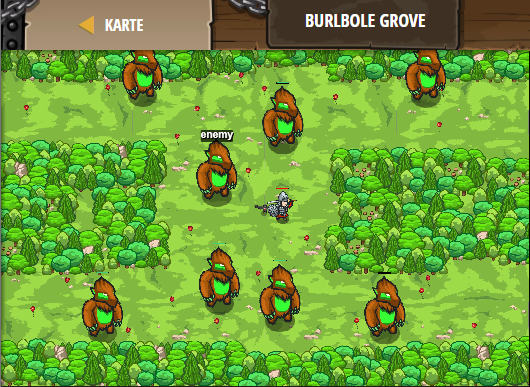

## **Burlbole Grove**
## Level 4.b84

#### Neu Gelerntes:
<b>-</b>

[comment]: <> (Was wurde gelernt und wie funktioniert die Technik?)

#### JavaScript-Code:
```js
function shouldAttack(target) {
    if (target && target.type !== "burl") {
        return true;
    }
    else {
        return false;
    }
}
while(true) {
    var enemy = hero.findNearestEnemy();
    var heroShouldAttack = shouldAttack(enemy);
    if(heroShouldAttack) {
        hero.attack(enemy);
    }
}
```
