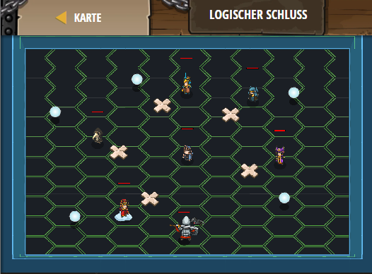

## **Logischer Schluss**
## Level 4.b85

#### Neu Gelerntes:
<b>-</b>

[comment]: <> (Was wurde gelernt und wie funktioniert die Technik?)

#### JavaScript-Code:
```js
hero.moveXY(24, 16);
var secretA = hero.findNearestFriend().getSecretA();
var secretB = hero.findNearestFriend().getSecretB();
var secretC = hero.findNearestFriend().getSecretC();
var tam = (secretA && secretB) || secretC;
hero.moveXY(19, 26);
hero.say(tam);
var zso = (secretA || secretB) && secretC;
hero.moveXY(26, 36);
hero.say(zso);
var ist = (secretA || secretC) && (secretB || secretC);
hero.moveXY(37, 34);
hero.say(ist);
var csi = (secretA && secretB) || (secretB && !secretC)
hero.moveXY(40, 22);
hero.say(csi);
```
