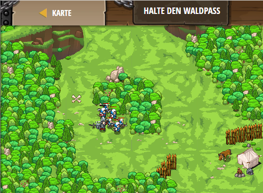

## **Halte den Waldpass**
## Level 4.b87

#### Neu Gelerntes:
<b>-</b>

[comment]: <> (Was wurde gelernt und wie funktioniert die Technik?)

#### JavaScript-Code:
```js
while(true) {
    var enemy = hero.findNearestEnemy();
    var flag = hero.findFlag();
    if(flag) {
        hero.pickUpFlag(flag);
    } else if (enemy) {
        hero.attack(enemy);
    }
}
```
