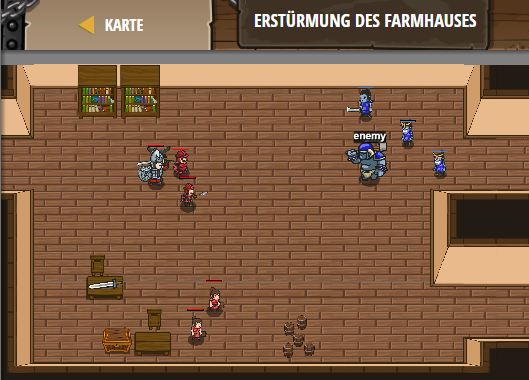

## **Erstürmung des Farmhauses**
## Level 4.b89

#### Neu Gelerntes:
<b>-</b>

[comment]: <> (Was wurde gelernt und wie funktioniert die Technik?)

#### JavaScript-Code:
```js
while(true) {
    var flag = hero.findFlag();
    var enemy = hero.findNearestEnemy();
    if(flag) {
        hero.pickUpFlag(flag);
        if (hero.isReady("cleave")) {
            hero.cleave(enemy);
        }
    } else {
        if (enemy) {hero.attack(enemy);
        }
    }
}
```
