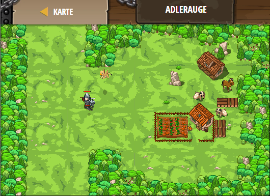

## **Adlerauge**
## Level 4.b9

#### Neu Gelerntes:
<b>-</b>

[comment]: <> (Was wurde gelernt und wie funktioniert die Technik?)

#### JavaScript-Code:
```js
// Vergiss nicht, dass Feinde der Feind jetzt noch nicht da sein muss.
while (true) {
    var enemy = hero.findNearestEnemy();
    // Wenn ein Feind da ist, greife es an!
    if (enemy) {
        hero.attack(enemy);
    }
}
```
