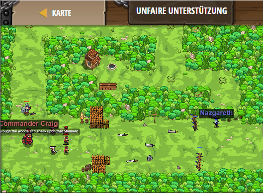

## **Unfaire Unterstützung**
## Level 4.b90

#### Neu Gelerntes:
<b>-</b>

[comment]: <> (Was wurde gelernt und wie funktioniert die Technik?)

#### JavaScript-Code:
```js
while(true) {
    var flag = hero.findFlag();
    var enemy = hero.findNearestEnemy();
    if (flag){
        hero.pickUpFlag(flag);
    } else if (enemy){
        hero.attack(enemy);
    }
}
```
