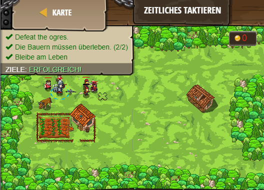

## **Zeitliches Taktieren**
## Level 4.b91

#### Neu Gelerntes:
<b>-</b>

[comment]: <> (Was wurde gelernt und wie funktioniert die Technik?)

#### JavaScript-Code:
```js
while(true) {
var flag = hero.findFlag("green");
var enemy = hero.findNearestEnemy();
if (flag) {
    hero.pickUpFlag(flag);    
}    
else if(enemy){
    if (hero.isReady("cleave")) {
        hero.cleave(enemy);        
    }
    else {
        hero.attack(enemy);
    }
    if (hero.isReady("warcry")) {
        hero.warcry(); 
    }   
}
}
```
