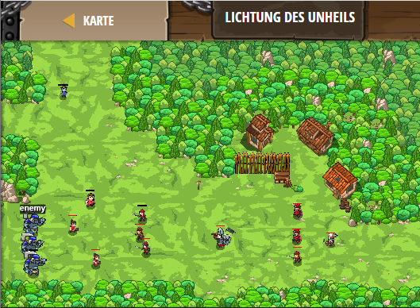

## **Verteidige die Garnison**
## Level 4.b92

#### Neu Gelerntes:
<b>-</b>

[comment]: <> (Was wurde gelernt und wie funktioniert die Technik?)

#### JavaScript-Code:
```js
while (true) {
    var flag = hero.findFlag("green");
    var fla = hero.findFlag("black");
    if (flag) {
        hero.pickUpFlag(flag);       
        var enemy = hero.findNearestEnemy();
        if (enemy) {
            if (hero.isReady("cleave")) {
                hero.cleave(enemy);       
            }
            else if (hero.cast("chain-lightning", enemy)){
                hero.cast("chain-lightning", enemy);
            }
        } 
    }
    if (fla) {
        hero.pickUpFlag(fla);
        if (hero.isReady("warcry")) {
            hero.warcry();
        }
        else if (hero.canCast("heal-wave", hero)){
            hero.cast("heal-wave");
        }
    }
    else {
        var enemy = hero.findNearestEnemy();
        if (enemy) {
            hero.attack(enemy);
        }        
    }
}
```
